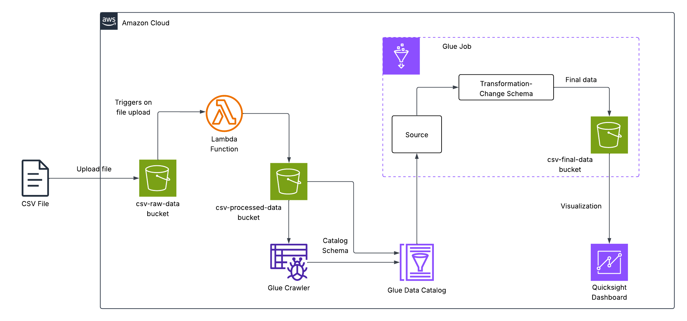
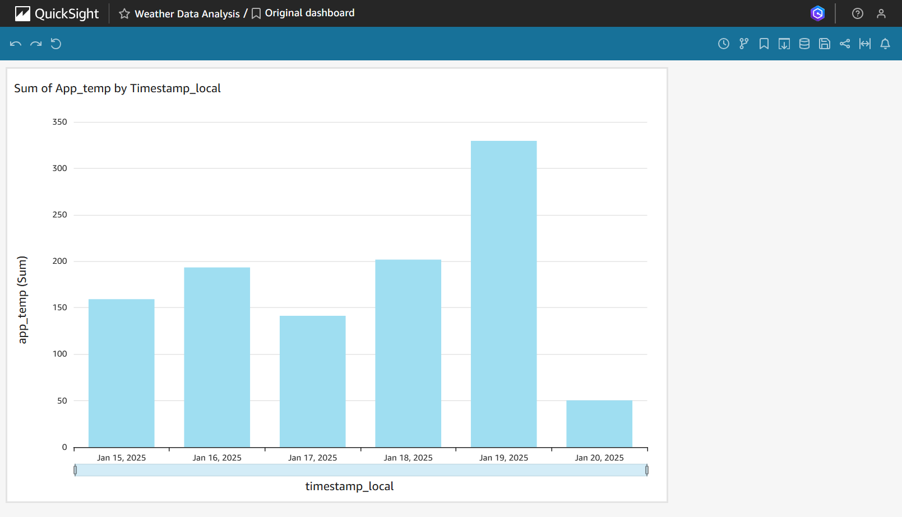

# AWS Weather Data Processing Pipeline
This project implements a serverless ETL pipeline for preprocessing weather data using AWS Lambda triggered by Amazon S3 events. Raw CSV files uploaded to the raw S3 bucket automatically invoke a Lambda function that cleans, transforms, and saves the processed output into a separate processed S3 bucket. The solution is built with Terraform, ensuring reproducible deployments and Infrastructure-as-Code best practices. Once the processed dataset is available, downstream services such as AWS Glue and Amazon QuickSight are used for cataloging, querying, and visualizing the data.

## Architecture Overview
  
*Figure 1: Architecture diagram of the Weather Data Processing Pipeline.*

- **Amazon S3** – Stores raw weather CSV files, cleaned/preprocessed data, and final transformed datasets.  
- **AWS Lambda** – Event-driven function that validates and filters raw CSV rows before saving to the processed bucket.  
- **AWS Glue Crawler & Data Catalog** – Scans processed data, infers schema, and creates a queryable table.  
- **AWS Glue Job** – Performs ETL transformations and loads final datasets into the S3 output bucket.  
- **Amazon QuickSight** – Connects to the final dataset for interactive dashboards and reporting.  
- **IAM Roles & Policies** – Enforce least-privilege access for Lambda, Glue, and S3 services.  

## Skills Applied
- Designing serverless ETL pipelines using AWS managed services.  
- Implementing data preprocessing logic with AWS Lambda.  
- Automating deployments with Terraform.  
- Building IAM roles and policies with least-privilege access, scoped to application resources (managed policies used where practical).  
- Structuring Infrastructure-as-Code projects for clarity and reusability.  
- Visualizing processed data with QuickSight.  

## Features
- Event-driven **data preprocessing** with Lambda.  
- **CSV cleaning** that filters out rows with missing values.  
- **Serverless and scalable** design with no servers to manage.  
- Supports **Glue ETL** for structured transformations and cataloging.  
- Enables **QuickSight dashboards** for interactive data visualization.  
- Core infrastructure (S3, Lambda, IAM) deployed via **Terraform IaC**.  

## Tech Stack
- **Languages:** Python 3.13  
- **AWS Services:** S3, Lambda, IAM, Glue, QuickSight
- **IaC Tool:** Terraform  
- **Other Tools:** AWS CLI  

## Deployment Instructions
> **Note:** All command-line examples use `bash` syntax highlighting to maximize compatibility and readability. 

> If you are using PowerShell or Command Prompt on Windows, the commands remain the same but prompt styles may differ.

> Glue and QuickSight resources are managed through the console for simplicity, but the IaC templates demonstrate the key serverless infrastructure (S3, Lambda, IAM) in Terraform.
 
To provision the required AWS infrastructure, deploy using **Terraform** templates as included in this repository.

### **Terraform**
1. Edit variables in `terraform.tfvars` and/or `variables.tf` to customize the deployment.
   
2. Navigate to the `terraform` folder and deploy:
   ```bash
   cd terraform
   terraform init
   terraform plan # Optional, but recommended.
   terraform apply
   ```

**Note**: Python 3.13 is recommended and tested for this project. Ensure your PATH environment variable includes the following entries (with priority above other Python versions):
- `..\Python313\`
- `..\Python313\Scripts`  

Also confirm the AWS CLI is configured (`aws configure`) with credentials that have sufficient permissions to create **S3 buckets**, **Lambda functions**, and manage **IAM roles**.

## How to Use
1. **Deploy the infrastructure** using Terraform.

2. **Create a new folder** named `raw` in the `csv-raw-data` S3 bucket. Upload the assets/weather_data.csv file to the folder to trigger the S3 event. Verify that the file was processed and copied to the `csv-processed-data/processed/` folder.

3. **Create the Glue resources manually in the AWS Management Console**, following these steps: setup a Glue Data Catalog, create a Glue Crawler to discover schema, create a Glue Job using Visual ETL, and prepare transformed data for visualization. See [GLUE_SETUP.md](assets/GLUE_SETUP.md) for full details.

4. **Visualize the data using QuickSight in the AWS Management Console**, following these steps: setup a QuickSight account, connect to the data source using the manifest.json file, build a QuickSight dashboard, and share/publish the dashboard. See [QUICKSIGHT_SETUP.md](assets/QUICKSIGHT_SETUP.md) for full details.

5. **Test pipeline with new data, ensuring dynamic updates.**

## Project Structure
```plaintext
aws-weather-data-processing-pipeline/
├── assets/                      # Images, diagrams, example data
│   ├── architecture-diagram.png      # Project architecture
│   ├── quicksight-dashboard.png	  # Dashboard image
│   ├── weather_data.csv			  # Sample data
│   ├── GLUE_SETUP.md	  			  # Glue setup instructions
│   └── QUICKSIGHT_SETUP.md	  		  # QuickSight setup instructions
├── terraform/                   # Terraform templates
│   ├── main.tf                       # Main Terraform config
│   ├── variables.tf                  # Input variables
│   ├── outputs.tf					  # Exported values
│   ├── terraform.tfvars              # Default variable values
│   ├── providers.tf			      # AWS provider definition
│   └── versions.tf					  # Terraform version constraint
├── src/                         # Lambda source code and manifest file
│    ├── preprocessing_function/	  # Lambda function
│    │  └── preprocessing_lambda.py       
│    └── manifest.json				  # Manifest file for QuickSight
├── LICENSE
├── README.md
└── .gitignore
```

## Screenshot


*Figure 2: Amazon QuickSight Dashboard created from final weather dataset.*  

## Future Enhancements
- Add automated error handling with SQS/DLQ for failed Lambda events.
- Extend Glue Jobs for data enrichment (e.g., additional weather sources or API integrations).
- Integrate CI/CD pipelines for Terraform deployments.
- Enable CloudWatch metrics and alarms for monitoring pipeline health.

## License
This project is licensed under the [MIT License](LICENSE).

---

## Author
**Patrick Heese**  
Cloud Administrator | Aspiring Cloud Engineer/Architect  
[LinkedIn Profile](https://www.linkedin.com/in/patrick-heese/) | [GitHub Profile](https://github.com/patrick-heese)

## Acknowledgments
This project was inspired by a course from [techwithlucy](https://github.com/techwithlucy).  
The Lambda function code is adapted directly from the author's original implementation.  
The architecture diagram included here is my own version, adapted from the original course diagram.  
I designed and developed all Infrastructure-as-Code (CloudFormation, SAM, Terraform) and project documentation.  
